# Background of the Data
- Data Source: https://www.kaggle.com/mlg-ulb/creditcardfraud

The datasets contains transactions made by credit cards in September 2013 
by european cardholders. 

This dataset presents transactions that occurred in two days,
where we have 492 frauds out of 284,807 transactions.

The dataset is highly imbalanced, the positive class (frauds)
account for 0.172% of all transactions.

Features V1, V2, ... V28 are the principal components obtained with PCA, the only features which have not been transformed with PCA are 'Time' and 'Amount'.

Feature 'Time' contains the seconds elapsed between each transaction and the first transaction in the dataset. The feature 'Amount' is the transaction Amount, this feature can be used for example-dependant cost-senstive learning.

Feature 'Class' is the response variable and it takes value 1 in case of fraud and 0 otherwise.

**Assumptions**:
- Here we have data for just two days, but we assume the data is representative of the whole population of credit card transactions.
- We assume the 28 variables V1-V28 are
obtained from correct method of PCA and scaled properly.

# Business Problem
When we purchase something using credit card we do not want anybody else illegally buy stuffs from our account by fraud and want to detect the fradulent activities.

From the given features (V1-V28, Amount, Time) we will build a model that will detect whether the transaction is fraudulent or not.

Here, Class is 1 means, fraud case and 0 means non-fraud case. Out of 1000 transactions, only 2 cases are fraud and other 998 cases are non-fraud. This means the dataset is hightly imbalanced.

For the imbalanced dataset, we can not use the usual accuracy metric to assess the performance of the model. If we simply build a model to predict all the transactions as non-fraud we will get 99.8% accuracy, which looks extremely good but its totally useless here since it failed to detect a single fraud case.

We are interested in fraud case not in the accuracy of the model. So, we can use the RECALL as the metric of the model evaluation.

Recall is `Recall = TP / (TP + FN)`. Here, False Negative is detecting a fraud as non-fraud. This case is more important than detecting non-fraud as fraud so we use `Recall` instead of `Precision` where other case would be much important such as in spam email detection.

We can also use AUPRC (Area Under Precision-Recall Curve) to assess the performance of the model.

For the imbalanced dataset we can also use MCC (Matthews Correlation Coefficient)

MCC is given by:
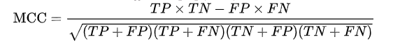

Accuracy and F1-score are given by following formula:
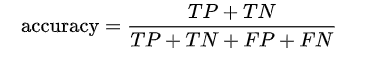
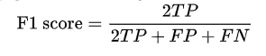

Best accuracy is 1 worst is 0.  
Best F1 score is 1 worst is 0.  
Best MCC score is +1 and worst is -1.  

Consider the following case:
```
TP = 95, FP = 5; TN = 0, FN = 0.

We get:
accuracy = 95%
F1 score = 97.44%
MCC = Undefined.
```

Another example:
```
TP = 90, FP = 4; TN = 1, FN = 5
accuracy = 91%
F1 score = 95.24%
MCC = 0.14
```

Also, we should note that F1-score depends on which class is defined as positive and which class is negative.

```
TP = 95, FP = 5; TN = 0, FN = 0 ==> F1 = 97.44
TP = 0, FP = 0; TN = 5, FN = 95 ==> F1 = 0
```

MCC does not depend on which class is defined as positive and which class is negative.

About the confusion matrix:
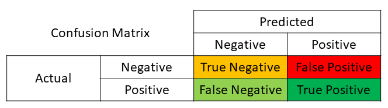
Here I am interested in the quantity False Negative, I want to make it as small as possible. (Ideally zero.) And True positive as high as possible.


# Get to know with the data (EDA)

## Class Balance
As we read in the description our dataset is heavily imbalanced. There are about 2 fruads in 1000 transactions.


If we run classification models (e.g. Logistic regression, Random Forest Regressor) they will wrongly classify all the cases as non-frauds and get accuracy of 99% but will fail to classify correctly any of the fraud cases.

We have two choices here, either undersample the data or over-sample the data. Most common method is undersampling. It makes the model run fast but at the cost of losing lots of lots of data points. Here in this project, if we undersmap the data, we will get 492 fraud cases. If we just take random sample of another 492 non-frauds our data will have roughly 1000 samples. Note that previously we had 285,000 samples.

Another way of dealing with imbalanced dataset is oversampling. One of the popular over-sampling method is called SMOTE (Synthetically Modified Oversampling Technique).

Resampling undersampling and oversampling can be described using [this image](https://www.kaggle.com/rafjaa/resampling-strategies-for-imbalanced-datasets)


[SMOTE Oversampling](http://rikunert.com/SMOTE_explained) will synthesize minority classes and matches with the majority classes.


For SMOTE sampling in python we can use [imbalanced-learn library](https://imbalanced-learn.readthedocs.io/en/stable/over_sampling.html) which will oversample the minority classes and creates a large dataset. In our project we have 284k non-frauds majority class and 500 samples of fraud minority case. 284k samples of fraud cases will be synthesized using the SMOTE algorithm and finally we will have 568k samples.

## Correlations
Here we look at the how the features are correlated with the target. I found that feature V17  and V14 is negatively correlated with Target and feature V11 and V4 are positively correlated with Target. This means if we increase the value of feature V17 we will see less fraudulent cases and vice versa.
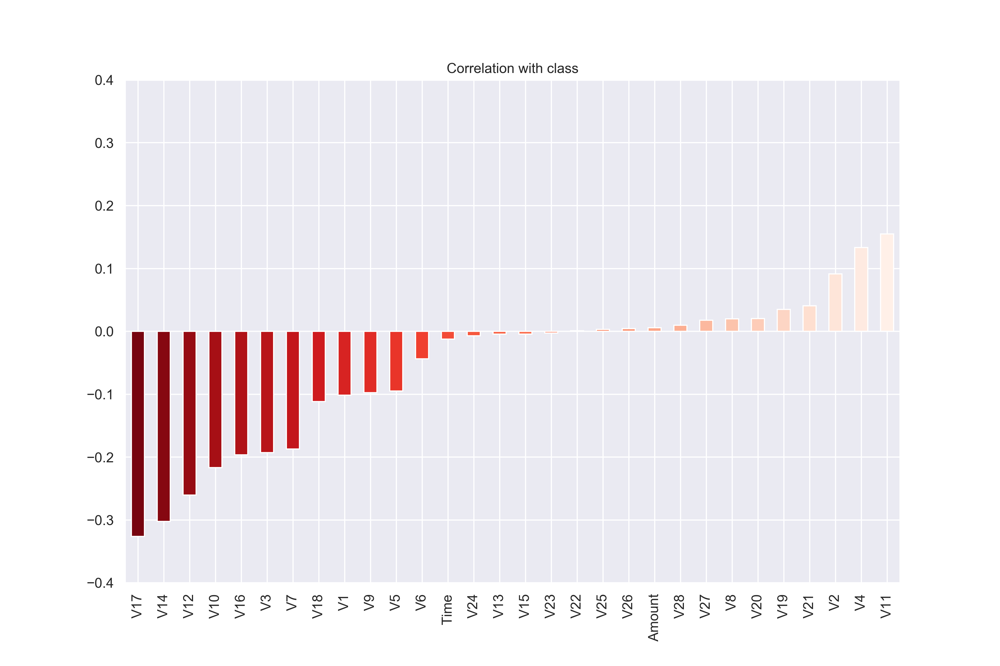

Negative Corelation:  
For the Class 1 (Fraud case), we can see that feature V17 has median -5, which is less than zero.
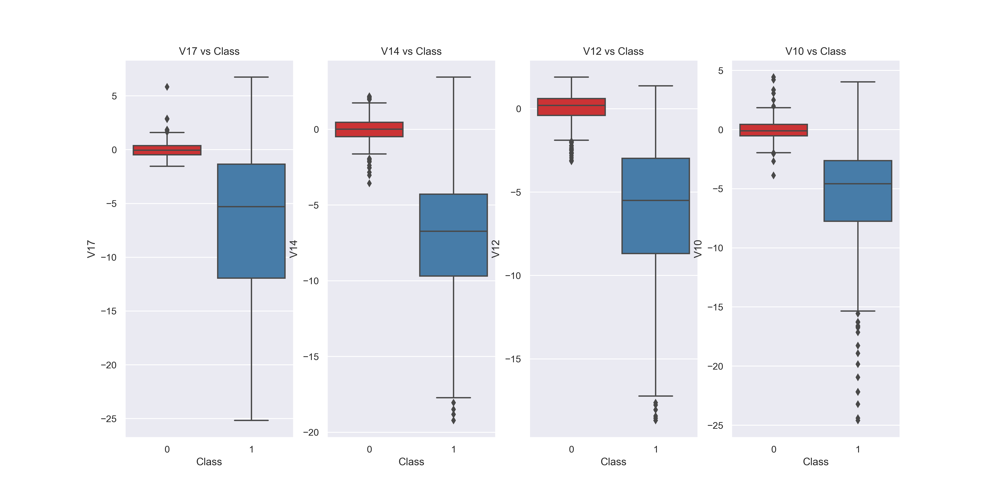

Positive Corelation:  
For the Class 1 (Fraud case), we can see that feature V11 has median about +4, which is greater than zero.
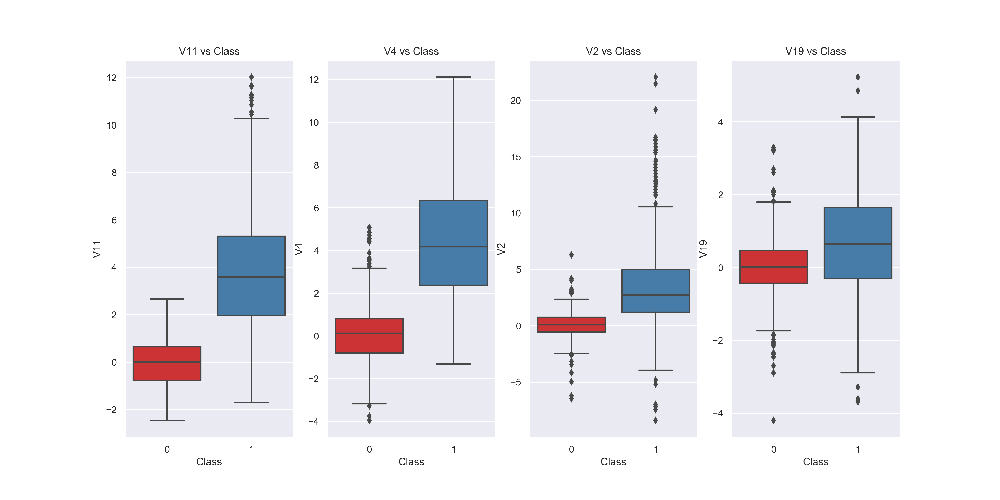


Sometimes we see collinearity between two features. If two features are collinear, they have high correlation corefficient between. If one feature increases another feature also increases and model will have difficulty which feature feature causes the changes in Target variable. If any two features are highly correlated (eg. r > 0.9) one the feature may be dropped from the dataset. Then there is a question which feature to keep and which feature to drop. We look at the correlation both features with the Target and keep the feature having larger correlation.
The correlation plot among the PCA transformed variables V1-V28 is given below. This shows there is not much collinearity among the features.
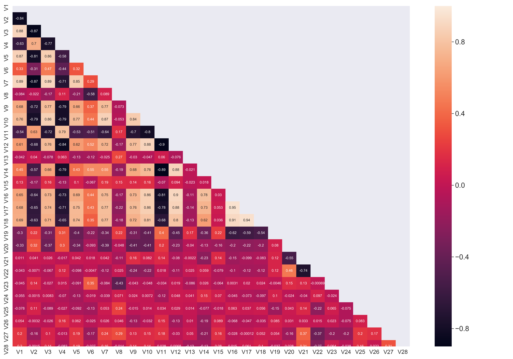

## Histograms of Features
For the linear models we have an underlying assumption that the features are independent of each others and they are all distributed like Gaussian. Histogram is one of the way inspecting wheter the features look like Gaussian distributed or not.

Here, features V1-V28 are already PCA transformed, I will not change them. But the feature `Amount` can be log transformed to make it look like more Gaussian. Also the feature `Time` can be log transformed to make it look like more Gaussian.
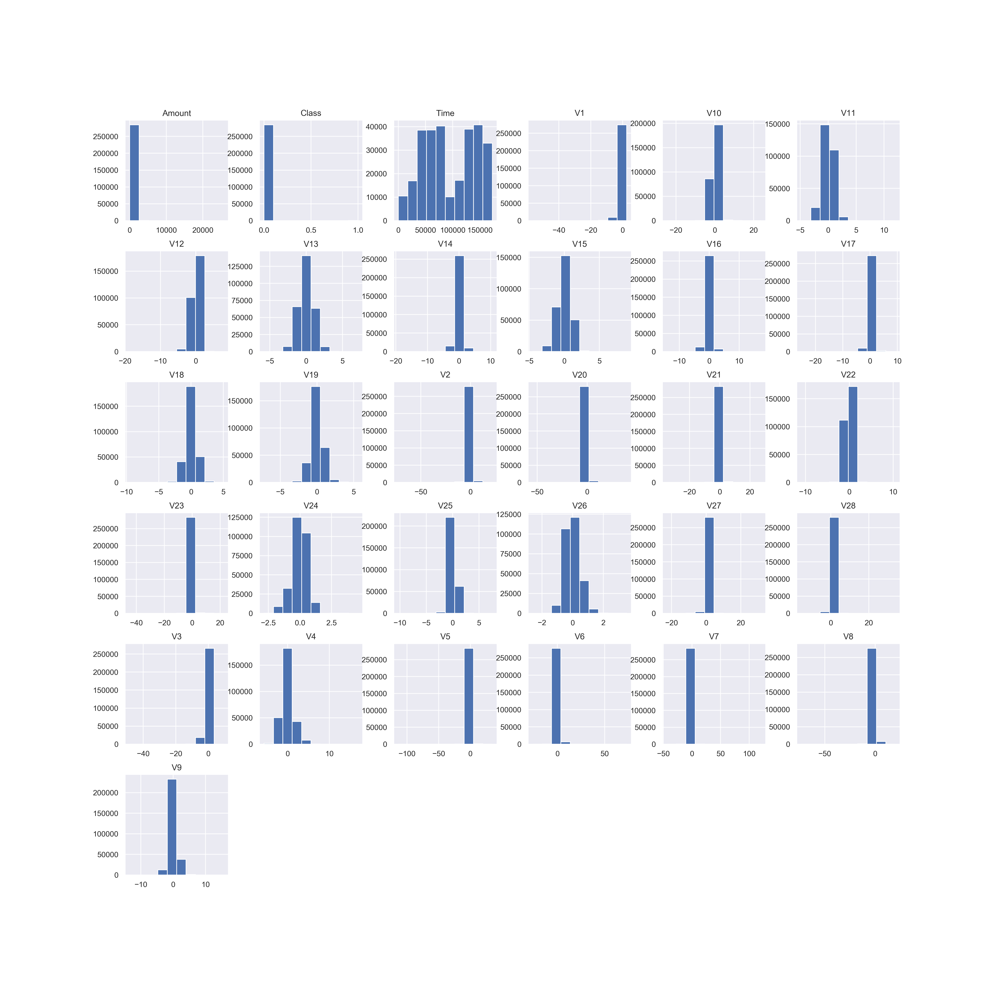

## Temporal Feature Study
Here, in this dataset we have one temporal variable called `Time`. This gives the time elapsed in seconds after the first transaction occur. The dataset says the data is from September of 2013, but it does not say which day it is and what is the first transaction time. If I assume, the first transaction time is 7AM, then the peak of fraud activity happened after two hours (9AM) and 11 hours (6PM).
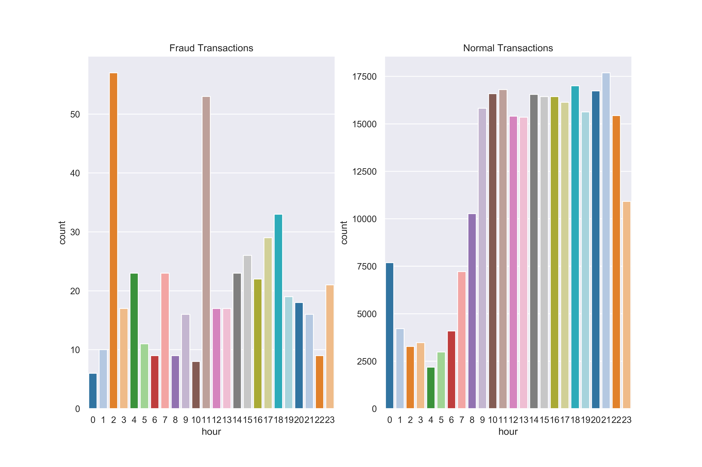

Distibution Plot of Time:
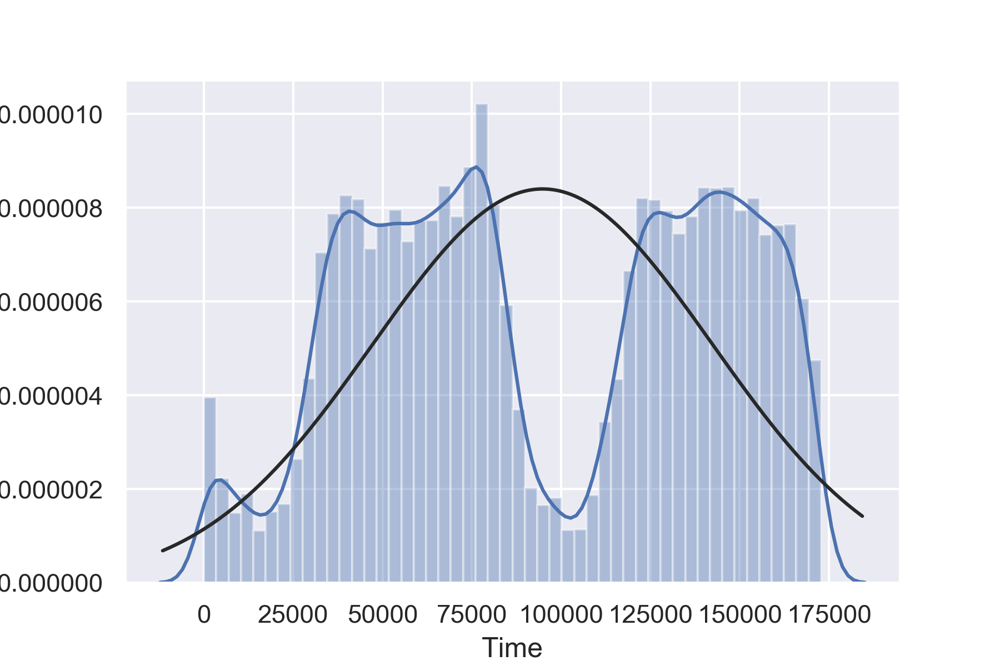
We can clearly see the bimodal distribution, this is because we have data of two days and distribution of transactions is somewhat similar in both of the days.

## Amount vs Target
Here we study the distribution of feature `Amount` and its relation with Target.
We see that most of transactions are below $100 for both fraud and non-fraud transactions.
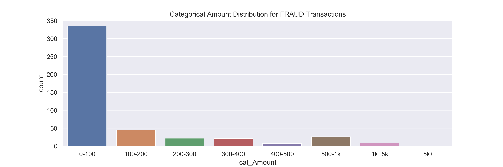
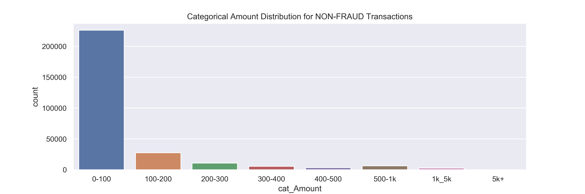

## Distribution Plots of Features
Our data set does not have too many features, it has 28 PCA transformed features and two usual features. We can look at the distribution plot of each features for the class distribution of fraud and non-fraud and if the distruption of these two classes are same we may want to drop this feature from the entire dataset.


For example, for the features V28 and V27, the class distribution are more or less same for fraud and non-fraud classes and we may drop these features.
But, when I looked at correlation of these features with Target, they have considerable correlation and I am planning to keep them for the analysis.

# Statistics
In statistics we sometimes are interested in the momentes of the variables. First four degrees of moments of a random variable has names: `mean`, `variance`, `skewness`, `kurtosis` and other moments are simply called moment of order n.


The first order moment is called mean.
For normal distribution mean is zero and variance is 1.


The third order moment is called skewness.
Normal distribution has skewness of 0.
If the skewness is less than 0, it is negatively skewed and has tail on left side. If the skewness is greater than 0, it is positively skewed and has tail on right side. In our dataset, some of the features are skewed. For example: feature V8 is negatively skewed and feature V28 is positively skewed.
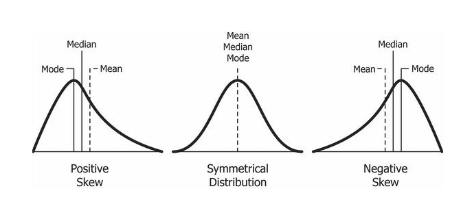
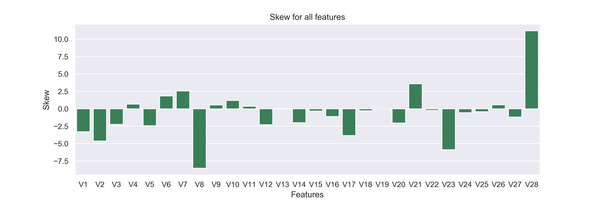


If we have skewed features, then they do not follow the Gaussian distribution,and underlying assumptions of linear regression is violated. To reduce the skewness we can do log transformation (or sqrt transformation or boxcox transformation and other transformations). Here, the features are already from PCA transformation, so I am keeping them as it is.


Kurtosis is related to the fourth moment. For Normal distribution, kurtosis has a value of 3. If kurtosis > 3 it is called lepto-kurtic and it is tall peaked and on the orther hand if kurtosis is less than 3, it is called platy-kurtic and looks flat. Normal distribution has other name meso-kurtic.


In our dataset some of the features have high kurtosis values. This indicates that there might be some outliers in these features. For example feature V28 has very high kurtosis value and it also has high skewness value. It might have some outliers.
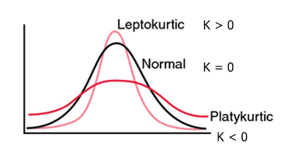


Look at the feature V28.
```
skewness = 11.2
kurtosis = 933.4
```

Lets look at the boxplot:
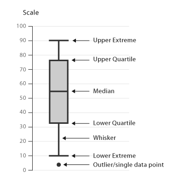
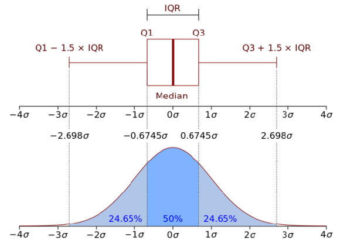

We can see that lots are possible outliers present in feature V28.
Outliers distort the model's ability to fit the data properly and sometimes if we are sure these are the true outliers, we should remove these outliers.

Now, lets see the interquartile ranges of PCA features:
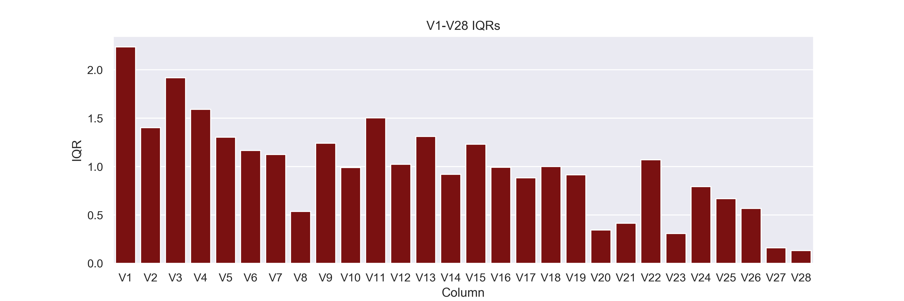
We can see feature V1 has large IQR range.

Let's also see the standard deviation.

IQR looks similar to standard deviations. We can say that there might not be too many outliers.

Finally, we can also look at all the features how their boxplots looks like:
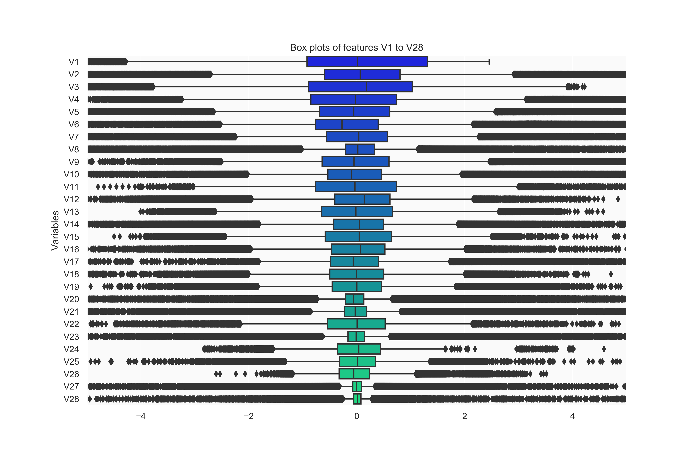

# Modelling Various Classifiers
I am mostly interested in designing a classifier that will give me the lowest
False Negative values. Or, which will give me the highest Recall. Accuracy is
not the concern here. Since our dataset is heavily imbalanced,
first I undersampled the dataset and tested various machine learning
classifier models.

**False Negative Frauds Detection using Default Classifiers for Undersampled Data**
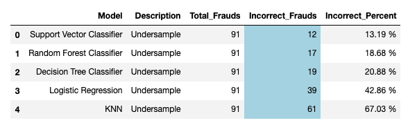

Then I did grid search to find the best hyperparameters
for all these models.

**False Negative Frauds Detection using Classifiers with Grid Search for Undersampled Data**
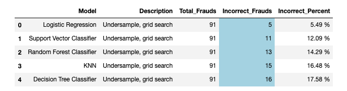

**Recall for all Classifiers with Grid Search for Undersampled Data**


**Classification Report for all Classifiers with Grid Search for Undersampled Data**
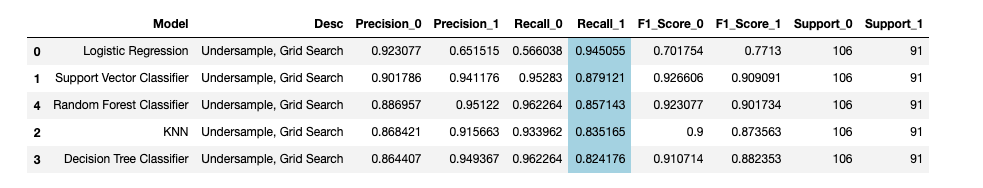

# Best Model from Grid Search for Underampled Data
I found that logistic regression is the best model for classification for this dataset.
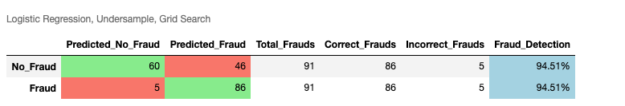
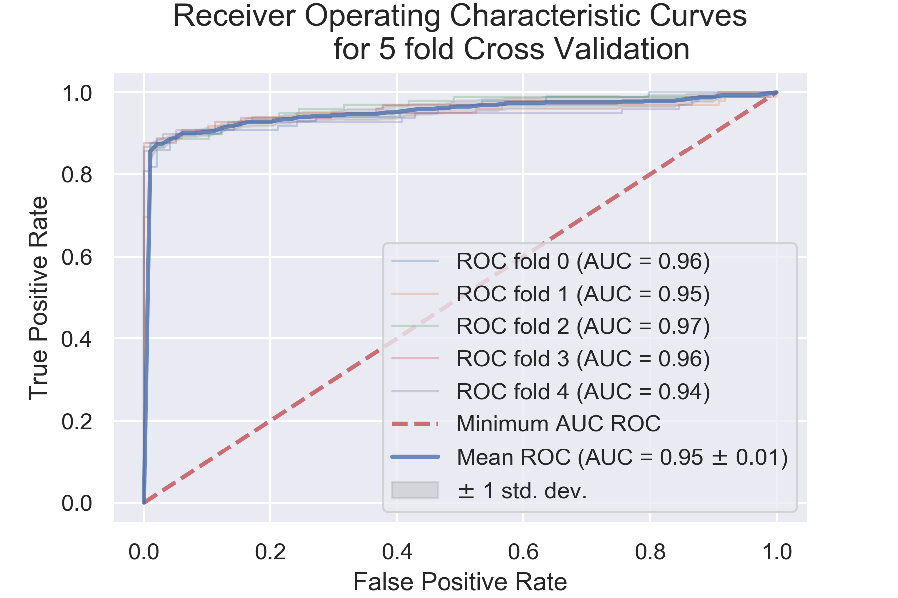
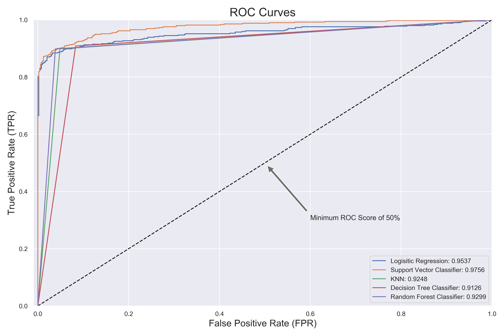

# Random Forest Classifier Underampled Data
One nice property of Random Forest is that, it gives the 
most important features in the dataset. For Undersampled
dataset, I found V20 was the most important feature.
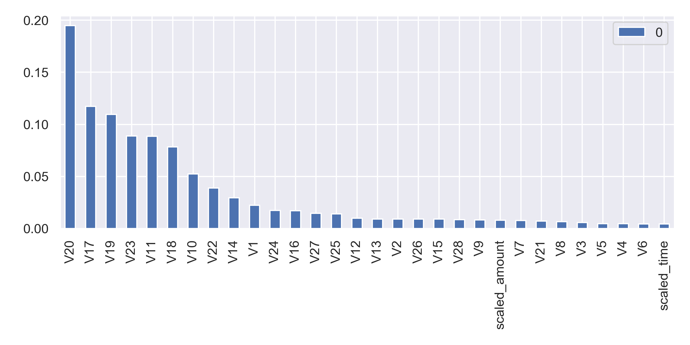
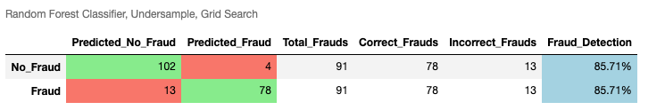

# Detail Study of Logistic Regression with SMOTE Oversampling
Undersampling only gives results good for undersampled test set since in machine learning modelling train and test must come same distribution. Undersampling is a good 
way to get better results if we already know the class labels. But in fraud detection we only know the fitting parameters but we dont know whether the transactions is 
normal or fraudulent in advance. So our test set must be imbalanced.

When I tested the logistic regression fitted from underampled training data, it gives ZERO recall for imbalanced test set.

We need to oversample our dataset. One of the most popular
resampling method to get oversampled data is SMOTE.
Here, I used SMOTE algorithm and get the Recall of 0.42857 for the imbalanced test set.

**Logistic Regression Model Evaluation Scalar Metrics**
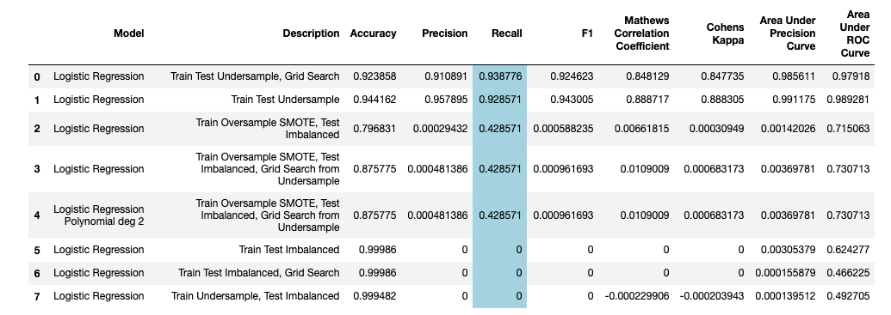


**Logistic Regression Model Evaluation Classification Metrics**
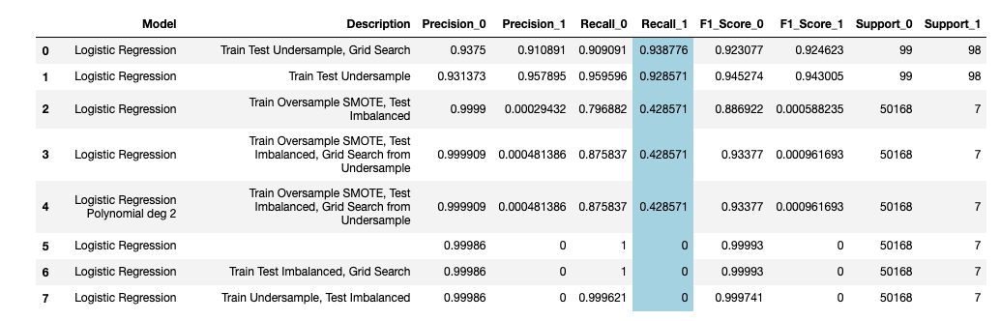

**Logistic Regression Confusion Matrix**
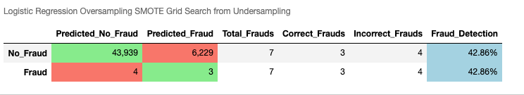

# Outlier Detection Models: Isolation Forest and Local Outliers Factor (LOF)
Two of the most popular models to use in Outlier Detection are Isolation Forest
and Local Outliers Factor. These models work directly on the imbalanced
dataset and we do not have to undersample or oversample the training dataset.

One technical note for these two models is that they give class results +1
and -1 and we need to change them to 0 and 1.
```python
ypreds[ypreds == 1] = 0
ypreds[ypreds == -1] = 1
ypreds_iso = ypreds
```

Isolation Forest gave me the better result than Local Outlier Factor.
```
Isolation Forest Results
-------------------------
Total Frauds:  98
Incorrect Frauds:  73
Incorrect Percent:  74.49 %

Local Outliers Factor
-------------------------
Total Frauds:  98
Incorrect Frauds:  95
Incorrect Percent:  96.94 %
```

# Modelling with LightGBM
For the underampled data I also tested the lightGBM model.
It is fast to train and gives decent results.

```
lightGBM Results
-------------------------
Total Frauds:  98
Incorrect Frauds:  62
Incorrect Percent:  63.27 %
```

After grid search, I got smaller number of errors:
```
LightGBM Grid Search Results
-------------------------
Total Frauds:  98
Incorrect Frauds:  19
Incorrect Percent:  19.39 %
```

# Deep Learning Methods
If we have large number of samples we can also use deep learning
methods to train our model. I got the following results for keras.
```
Keras Imbalaned Data Results
-------------------------
Total Frauds:  98
Incorrect Frauds:  94
Incorrect Percent:  95.92 %

Keras Undersampled Train Test Results
-------------------------
Total Frauds:  98
Incorrect Frauds:  7
Incorrect Percent:  7.14 %
```

# Big Data Analysis method using PySpark
For the imbalanced dataset I trained differet classifiers using the pyspark
module.
I got the best result for weighted Recall for random forest classifier after a
grid search.

The results are shown below:
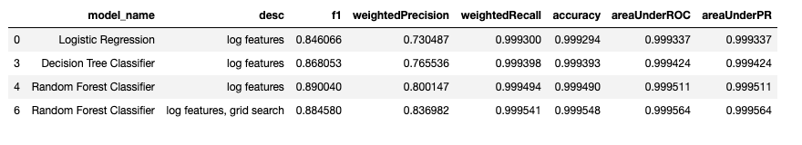